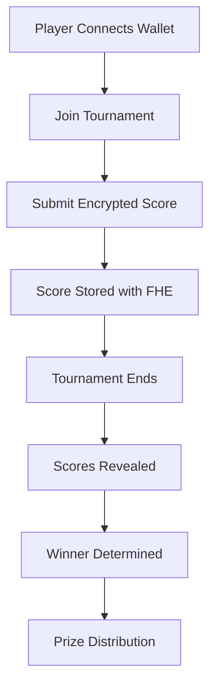

# 🛡️ Crypto Score Guard

<div align="center">


**Revolutionary Gaming Platform with FHE Technology**

*Ensuring Fair Play Through Cryptographic Innovation*

[](https://vercel.com/new/clone?repository-url=https://github.com/cameronking88/crypto-score-guard)
[](https://opensource.org/licenses/MIT)
[](https://ethereum.org)
[](https://zama.ai)

</div>

---

## 🎮 What is Crypto Score Guard?

Crypto Score Guard is a **next-generation gaming platform** that leverages **Fully Homomorphic Encryption (FHE)** to create the world's first truly fair competitive gaming environment. No more mid-tournament sniping, no more score manipulation - just pure, cryptographic fairness.

### 🔐 The Problem We Solve

Traditional gaming tournaments suffer from:
- **Score Sniping**: Players can see others' scores and adjust their strategy
- **Manipulation**: Scores can be tampered with during tournaments
- **Lack of Transparency**: No verifiable proof of fairness
- **Trust Issues**: Players must trust centralized systems

### ⚡ Our Solution

- **🔒 FHE Encryption**: All scores encrypted until tournament ends
- **🛡️ Cryptographic Fairness**: Mathematical proof of integrity
- **🌐 Web3 Integration**: Decentralized and transparent
- **🎯 Real-time Leaderboards**: Encrypted but functional

---

## 🚀 Quick Start

### Prerequisites

- **Node.js** 18+ 
- **Web3 Wallet** (MetaMask, WalletConnect, etc.)
- **Sepolia ETH** for gas fees

### Installation

```bash
# Clone the repository
git clone https://github.com/cameronking88/crypto-score-guard.git

# Navigate to project
cd crypto-score-guard

# Install dependencies
npm install

# Start development server
npm run dev
```

### Environment Setup

Create `.env.local`:

```env
NEXT_PUBLIC_CHAIN_ID=11155111
NEXT_PUBLIC_RPC_URL=https://sepolia.infura.io/v3/YOUR_KEY
NEXT_PUBLIC_WALLET_CONNECT_PROJECT_ID=YOUR_PROJECT_ID
```

---

## 🏗️ Architecture

### Frontend Stack
```
┌─────────────────┐    ┌─────────────────┐    ┌─────────────────┐
│   React 18      │    │   TypeScript    │    │   Tailwind CSS  │
│   + Vite        │    │   + ESLint      │    │   + shadcn/ui   │
└─────────────────┘    └─────────────────┘    └─────────────────┘
         │                       │                       │
         └───────────────────────┼───────────────────────┘
                                 │
                    ┌─────────────────┐
                    │   Web3 Layer    │
                    │ RainbowKit +    │
                    │ Wagmi + Viem    │
                    └─────────────────┘
```

### Smart Contract Stack
```
┌─────────────────┐    ┌─────────────────┐    ┌─────────────────┐
│   Solidity      │    │   Zama FHE      │    │   Sepolia       │
│   ^0.8.24       │    │   Library       │    │   Testnet       │
└─────────────────┘    └─────────────────┘    └─────────────────┘
```

---

## 🎯 Core Features

### 🔐 FHE Score Submission
```typescript
// Scores are encrypted before submission
const encryptedScore = await fhe.encrypt(score);
await contract.submitScore(tournamentId, encryptedScore);
```

### 🏆 Tournament Management
- **Create Tournaments**: Set rules, duration, and prizes
- **Join Tournaments**: Register with encrypted entry
- **Submit Scores**: FHE-encrypted score submission
- **Reveal Results**: Fair score decryption and ranking

### 🛡️ Security Features
- **Zero-Knowledge Proofs**: Verify without revealing
- **Access Control**: Role-based permissions
- **Reputation System**: Track player integrity
- **Audit Trail**: Complete transaction history

---

## 🎮 How It Works



### Step-by-Step Process

1. **🔗 Connect Wallet**: Link your Web3 wallet
2. **🏆 Join Tournament**: Register for active tournaments
3. **🎯 Submit Score**: Encrypt and submit your score
4. **⏳ Wait**: Scores remain encrypted during tournament
5. **🔓 Reveal**: Scores decrypted after tournament ends
6. **🏅 Win**: Fair winner determination and prizes

---

## 🛠️ Development

### Available Scripts

```bash
npm run dev          # Start development server
npm run build        # Build for production
npm run preview      # Preview production build
npm run lint         # Run ESLint
npm run type-check   # TypeScript type checking
```

### Project Structure

```
src/
├── components/          # React components
│   ├── ui/             # shadcn/ui components
│   ├── GameHeader.tsx  # Main header
│   ├── Leaderboard.tsx # Score leaderboard
│   └── WalletConnect.tsx # Web3 integration
├── lib/                # Utilities and configs
│   └── wagmi.ts        # Wagmi configuration
├── pages/              # Application pages
└── hooks/              # Custom React hooks

contracts/
└── CryptoScoreGuard.sol # FHE smart contract
```

---

## 🔧 Configuration

### Network Settings
- **Chain**: Ethereum Sepolia Testnet
- **Chain ID**: 11155111
- **RPC**: Infura / 1rpc.io
- **Explorer**: https://sepolia.etherscan.io

### Wallet Support
- ✅ **MetaMask**
- ✅ **WalletConnect**
- ✅ **Rainbow**
- ✅ **Coinbase Wallet**
- ✅ **Trust Wallet**

---

## 🚀 Deployment

### Vercel (Recommended)

[](https://vercel.com/new/clone?repository-url=https://github.com/cameronking88/crypto-score-guard)

1. Click the deploy button above
2. Configure environment variables
3. Deploy to production

### Manual Deployment

See [VERCEL_DEPLOYMENT.md](./VERCEL_DEPLOYMENT.md) for detailed instructions.

---

## 🧪 Testing

### Smart Contract Testing
```bash
# Deploy to Sepolia testnet
npx hardhat run scripts/deploy.js --network sepolia

# Run tests
npx hardhat test
```

### Frontend Testing
```bash
# Run component tests
npm run test

# Run E2E tests
npm run test:e2e
```

---

## 🤝 Contributing

We welcome contributions! Please see our [Contributing Guide](CONTRIBUTING.md).

### Development Workflow

1. **Fork** the repository
2. **Create** a feature branch
3. **Make** your changes
4. **Test** thoroughly
5. **Submit** a pull request

---

## 📊 Roadmap

### Phase 1: Core Platform ✅
- [x] FHE score encryption
- [x] Web3 wallet integration
- [x] Tournament management
- [x] Basic UI/UX

### Phase 2: Advanced Features 🚧
- [ ] Multi-chain support
- [ ] NFT rewards
- [ ] Mobile app
- [ ] Advanced analytics

### Phase 3: Ecosystem 🌟
- [ ] SDK for game developers
- [ ] API for third-party integration
- [ ] Governance token
- [ ] DAO management

---

## 🛡️ Security

### Audit Status
- **Smart Contract**: 🔄 In Progress
- **Frontend**: ✅ Reviewed
- **Infrastructure**: ✅ Secured

### Bug Bounty
Found a security issue? Please report it responsibly:
- **Email**: security@cryptoscoreguard.com
- **PGP**: [Public Key](https://cryptoscoreguard.com/pgp.asc)

---

## 📄 License

This project is licensed under the **MIT License** - see the [LICENSE](LICENSE) file for details.

---

## 🙏 Acknowledgments

- **Zama** for FHE technology
- **RainbowKit** for Web3 integration
- **shadcn/ui** for beautiful components
- **Vercel** for deployment platform

---

## 📞 Support

- **Documentation**: [docs.cryptoscoreguard.com](https://docs.cryptoscoreguard.com)
- **Discord**: [Join our community](https://discord.gg/cryptoscoreguard)
- **Twitter**: [@CryptoScoreGuard](https://twitter.com/cryptoscoreguard)
- **Email**: support@cryptoscoreguard.com

---

<div align="center">

**Built with ❤️ by the Crypto Score Guard Team**

*Revolutionizing gaming fairness through cryptography*

[](https://github.com/cameronking88)
[](https://cryptoscoreguard.com)

</div>